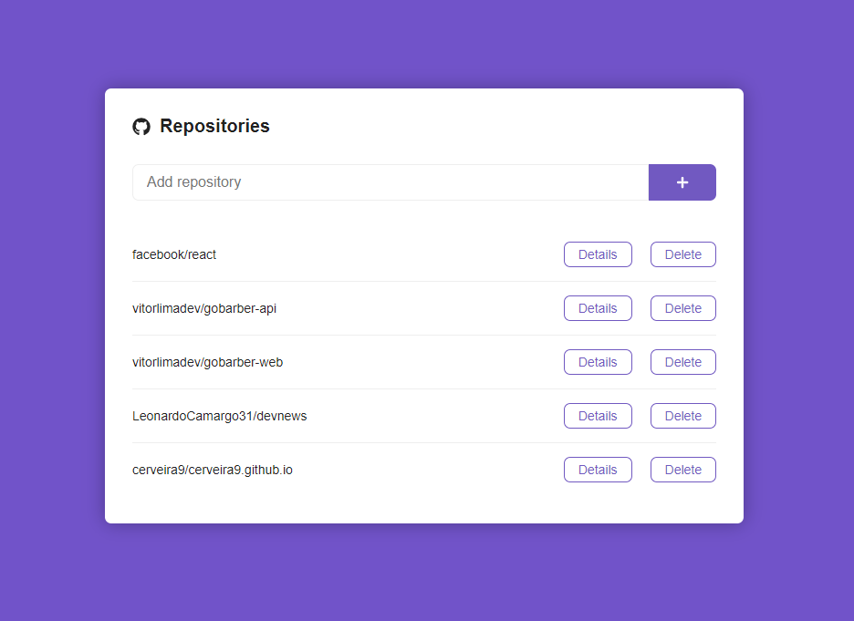

# Github Showcase
A React app that consumes the Github API to show repositories information.

You can add repositories to the list.

See the details of the repository and access it's github page.

You can see the issues list and access the issue.

